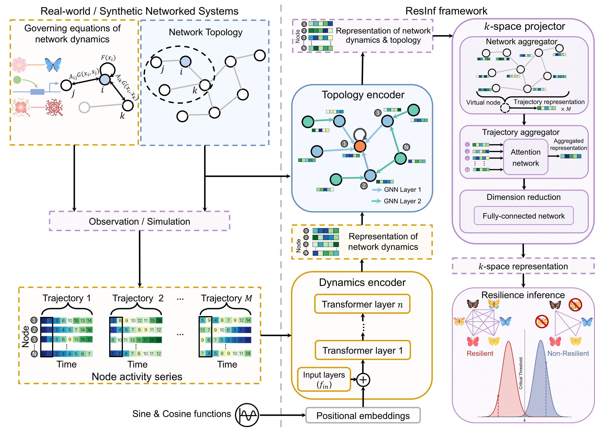

# ResInf resilience inference

 

---

This repository contains the source codes and data for our paper submitted and under review :

Chang Liu, Fengli Xu, Chen Gao, Zhaocheng Wang, Yong Li and Jianxi Gao, **Deep learning resilience inference for complex networked systems**.

# Installation

### Environment

- **Tested OS:** Linux
- Python >= 3.8
- PyTorch >= 1.7.0

### Dependencies

1. Import [PyTorch](https://pytorch.org) with the correct CUDA version.

### Data availability

You can get network data from the following Dropbox link: 

https://www.dropbox.com/sh/azcolc4xpf37kg8/AABPxHFpIlIR2l7qhgGg3yoXa?dl=0

# Training 

To train a model for resilience inference of mutualistic networks, run:

`python main.py --mech 1`

while gene regulatory networks and neuronal networks correspond to 2 and 3, respectively.

# License

Please see the license for further details.
