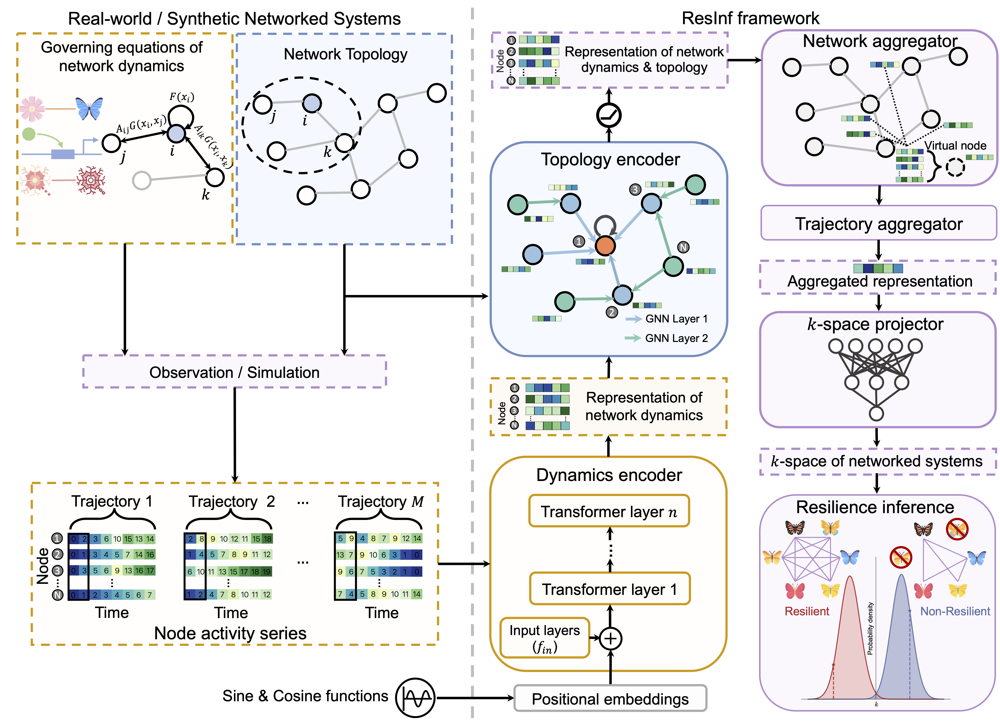

# 
 Deep Learning Resilience Inference for Complex Networked Systems 

#####  
 Chang Liu1, [Fengli Xu1](https://fenglixu.github.io/), [Chen Gao1](https://fi.ee.tsinghua.edu.cn/~gaochen/), [Zhaocheng Wang1](http://oa.ee.tsinghua.edu.cn/~bcspl/), [Yong Li1](https://fi.ee.tsinghua.edu.cn/~liyong/), [Jianxi Gao2](https://www.gaojianxi.com/)

 ##### 
 1Tsinghua University, 2Rensselaer Polytechnic Institute

 

---

This repository contains the source codes and data for our paper published in *Nature Communications*:

Chang Liu, Fengli Xu, Chen Gao, Zhaocheng Wang, Yong Li and Jianxi Gao, **Deep learning resilience inference for complex networked systems**.

The source code is mainly implemented in Python.

# Installation

### Environment

- **Tested OS:** Linux
- Python >= 3.8
- PyTorch >= 1.7.0

### Dependencies

1. Run `pip install -r requirements.txt` to install all dependencies required in your machine.
2. Import [PyTorch](https://pytorch.org) with the correct CUDA version.

The installation time will take no longer than 30 minutes on a "normal" desktop computer with good Internet conditions.

### Data availability

You can access the data from [Google Drive link](https://drive.google.com/drive/folders/1HTYuJuaRMUV2grBbELBRpB6ZnkRXsc4A?usp=sharing). 

Download the data and put it into the `data` folder.

# Demo

We provide a demo regarding our model. The usage is listed as follows:
- Open the demo script: `./demo/demo.ipynb`
- Run the jupyter notebook in the created experimental environment

The expected output is Figure 7(a) of the main text of our manuscript. The expected run time of the demo will take no longer than 5 minutes on a "normal" desktop computer.

## Options
We provide three demo files, `one_dim_vecs_demo.npy`, `preds_demo.npy`, and `truths_demo.npy`, which aims to reproduce Figure 7(a) of our manuscript.

You can also replace Line 51 in the demo script with `args = parser.parse_args(args=['--load', '0'])`. The demo will load our pre-trained model and plot other test networks in the $k$-space. Output files are `one_dim_vecs.npy`, `preds.npy`, and `truths.npy`.

# Training

If you want to use `wandb`, please add `--use_wandb` to each instruction.

## Synthetic datasets
To train a model for resilience inference of mutualistic networks, run:

`python run_synthesis.py --mech 1`

while gene regulatory networks and neuronal networks correspond to 2 and 3, respectively.

To train a model for epidemic networks, for example, CNS, run:

`python run_epidemic.py --dataset_name CNS`

you can replace `CNS` with `SFHH`, `CM`, and `CP` to train and test on other epidemic networks.

## Generalizability
To evaluate the generalizability of ResInf across different dynamics parameters, run:

`python run_general_para.py --mech 1`

where `--mech 1` can be replaced with `--mech 2` and `--mech 3`.

To evaluate the generalizability of ResInf across different dynamics equations, run:

`python run_general_equ.py --train_mech [4, 5] --val_mech [3]`

`mech 4` and `mech 5` correspond to SIS and Inhibitory dynamics, respectively. The above instruction indicates that you train the model on mixed networks with `SIS` and `Inhibitory` dynamics, and test on `Neuronal` networks.

## Real-world datasets
You can train and test our model on microbial communities, run:

`python run_micro.py`

or you can train our model on simulated data (SIS dynamics systems) and test it on microbial communities, run:

`python run_s2r.py`

# License

Please see the [license](LICENSE) for further details.
